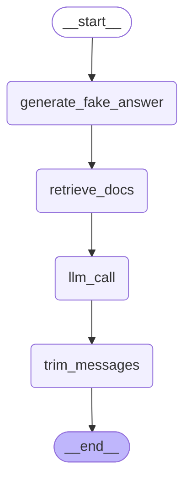

# RAG：HyDE（假设文档嵌入）

- graph

```mermaid
graph TD;
	__start__([<p>__start__</p>]):::first
	generate_fake_answer(generate_fake_answer)
	retrieve_docs(retrieve_docs)
	llm_call(llm_call)
	trim_messages(trim_messages)
	__end__([<p>__end__</p>]):::last
	__start__ --> generate_fake_answer;
	generate_fake_answer --> retrieve_docs;
	llm_call --> trim_messages;
	retrieve_docs --> llm_call;
	trim_messages --> __end__;
	classDef default fill:#f2f0ff,line-height:1.2
	classDef first fill-opacity:0
	classDef last fill:#bfb6fc
```

- 图片来源：`Milvus` 官方网站

