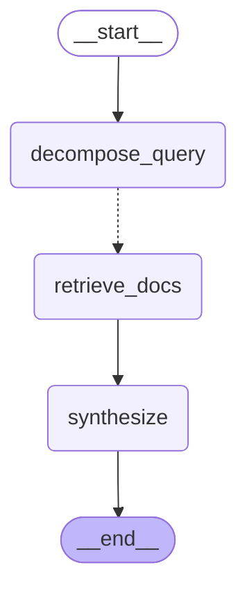

# RAG：创建子查询

把用户提问分解为子查询，使用每个子查询分别做检索，最后汇总。

- graph

```mermaid
graph TD;
	__start__([<p>__start__</p>]):::first
	decompose_query(decompose_query)
	retrieve_docs(retrieve_docs)
	synthesize(synthesize)
	__end__([<p>__end__</p>]):::last
	__start__ --> decompose_query;
	decompose_query -.-> retrieve_docs;
	retrieve_docs --> synthesize;
	synthesize --> __end__;
	classDef default fill:#f2f0ff,line-height:1.2
	classDef first fill-opacity:0
	classDef last fill:#bfb6fc
```

- 图片来源：`Milvus` 官方网站

