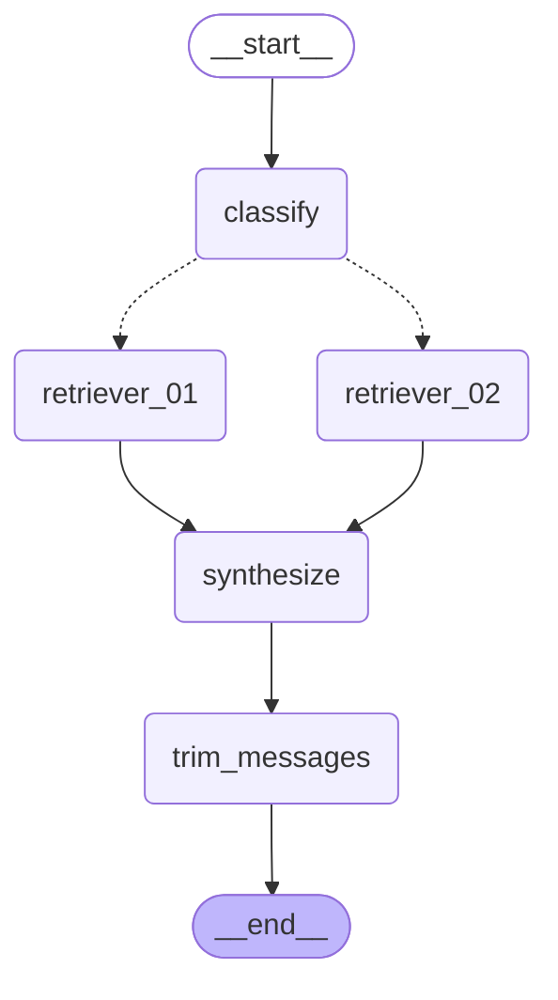

# RAG：创建子查询

把用户提问分解为子查询，并对子查询分类，不同的子查询去检索其对应的知识库，最后汇总。

在 `10_sub_query_with_classify` 的基础上变为了有状态的路由查询，支持多轮对话。

- graph

```mermaid
graph TD;
	__start__([<p>__start__</p>]):::first
	classify(classify)
	retriever_01(retriever_01)
	retriever_02(retriever_02)
	synthesize(synthesize)
	trim_messages(trim_messages)
	__end__([<p>__end__</p>]):::last
	retriever_01 --> synthesize;
	retriever_02 --> synthesize;
	__start__ --> classify;
	classify -.-> retriever_01;
	classify -.-> retriever_02;
	synthesize --> trim_messages;
	trim_messages --> __end__;
	classDef default fill:#f2f0ff,line-height:1.2
	classDef first fill-opacity:0
	classDef last fill:#bfb6fc
```

- 图片来源：`Milvus` 官方网站

